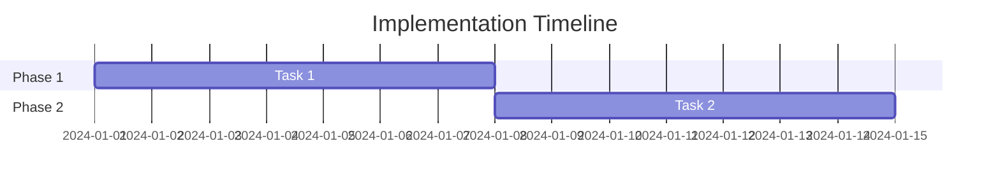

# {Spec Title}

## Overview

Brief description of what this specification covers.

## Problem Statement

### Current State
Describe the current situation and its problems.

### Desired State
Describe what success looks like.

### Success Metrics
- [ ] Metric 1
- [ ] Metric 2

## Proposed Solution

### High-Level Approach
Overview of the solution.

### Technical Design
Detailed technical design (or link to separate doc).

### Alternatives Considered
| Option | Pros | Cons | Decision |
|--------|------|------|----------|
| Option A | ... | ... | Rejected |
| Option B | ... | ... | **Selected** |

## Implementation Phases

### Phase 1: {Phase Name}
- **Duration**: X weeks
- **Goal**: ...
- **Deliverables**:
  - [ ] Item 1
  - [ ] Item 2

### Phase 2: {Phase Name}
- **Duration**: X weeks
- **Goal**: ...
- **Deliverables**:
  - [ ] Item 1
  - [ ] Item 2

## Risks & Mitigations

| Risk | Impact | Probability | Mitigation |
|------|--------|-------------|------------|
| Risk 1 | High | Medium | ... |

## Dependencies

- Dependency 1
- Dependency 2

## Timeline

## References

- Link to related ADRs
- Link to explorations
- External documentation
